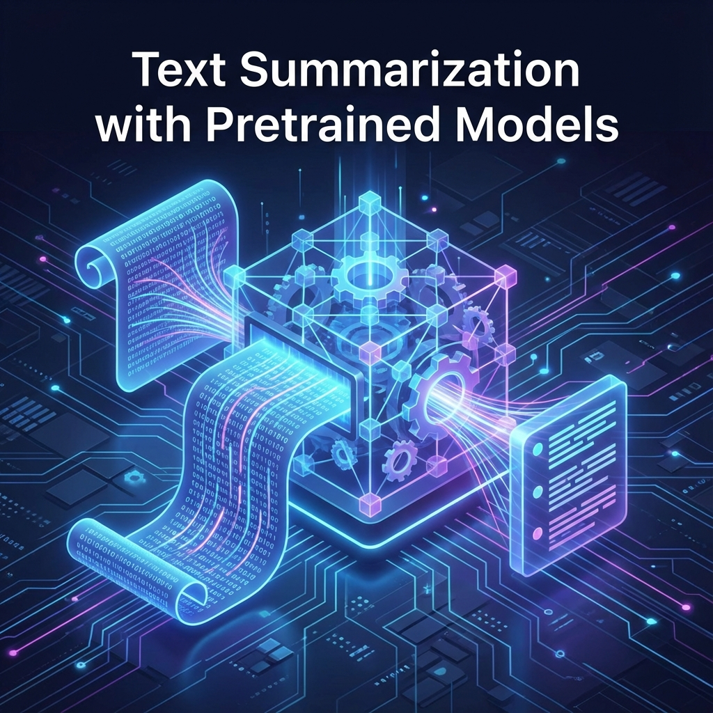

# Text Summarization with Pretrained Models 📝🤖

## Project Overview 🎯
This project is an **educational, hands-on notebook** designed to teach the fundamentals of **Abstractive Text Summarization** using state-of-the-art pretrained **Transformer models** from Hugging Face.

The goal is to demystify complex NLP concepts by providing a simple, step-by-step guide that allows beginners and students to build their own summarization pipeline and interact with it through a web interface.

## What are Pretrained Models? 🧠
Pretrained models are Deep Learning models that have been previously trained on massive datasets (broadly "reading the internet") to learn the general rules, grammar, and context of human language.


**Why are they useful in NLP?**
*   **Transfer Learning**: Instead of training a model from scratch (which takes weeks and massive compute power), we can "fine-tune" these smart models for specific tasks.
*   **Performance**: They achieve state-of-the-art results on translation, summarization, and question-answering tasks.

## What is Text Summarization? ✨
Text summarization is the automated process of shortening a text document while retaining its main ideas. This project focuses on **Abstractive Summarization**:


*   **Abstractive**: The model generates *new sentences* to rephrase the core meaning, similar to how a human would write a summary.
*   **Extractive**: Merely selects and copies important existing sentences from the text.

**Real-World Use Cases:**
*   Summarizing news articles 📰
*   Condensing medical reports 🏥
*   Generating meeting minutes 📅

## Models Used 🚀
We explore three distinct Transformer models in this notebook:

1.  **BART (English)** 🇺🇸
    *   Developed by Facebook.
    *   Combines the bidirectional understanding of BERT with the generative capabilities of GPT. Great for general summarization.
2.  **PEGASUS (English – News)** 📰
    *   Developed by Google.
    *   Specifically designed for abstractive summarization. It is particularly strong at summarizing news articles.
3.  **mT5 (Multilingual)** 🌎
    *   A massive multilingual model that treats every NLP task as a "text-to-text" problem.
    *   Capable of summarizing text in over 100 languages.

## Features 🌟
*   **Step-by-Step Guide**: Detailed explanations inside the notebook for every code cell.
*   **Multiple Model Comparison**: Run different models side-by-side to see how their summaries differ.
*   **Interactive Gradio Interface**: A user-friendly web UI where you can paste your own text and get instant summaries.
*   **Results Table**: Automatically stores and displays generated summaries in a structured table for easy comparison.

## Technologies & Tools 🛠️
*   **Python** 🐍
*   **Hugging Face Transformers** 🤗
*   **Gradio** (for the web interface) ⚡
*   **Pandas** (for data handling) �
*   **PyTorch** 🔥

## How to Run the Project 🏃‍♂️

1.  **Clone the repository**
    ```bash
    git clone [LINK_TO_REPO_PLACEHOLDER]
    cd [REPO_NAME]
    ```

2.  **Install dependencies**
    Ensure you have Python installed, then run:
    ```bash
    pip install transformers torch gradio pandas
    ```

3.  **Run the Notebook**
    Open `hands-on-text-summarization.ipynb` in Jupyter Notebook, JupyterLab, or VS Code and run the cells sequentially to follow the lesson.

    *Alternatively, strictly to launch the Gradio app, run the specific cells in the "Models Deployment" section.*

## Project Structure 📂
*   `hands-on-text-summarization.ipynb`: The main educational notebook containing all code, explanations, and the Gradio app.
*   `images/`: Folder containing assets for this README.
*   `README.md`: This documentation file.

## Educational Purpose 🎓
This notebook was explicitly created for **beginners and students**. The philosophy is **"Learning-by-Doing"**:
*   No prior advanced NLP knowledge is required.
*   Concepts are explained simply before code implementation.
*   The code is modular and easy to experiment with.


## Links 🔗
*   **Kaggle Notebook**: [https://www.kaggle.com/code/abdelrahmanmahmoud22/hands-on-text-summarization]
